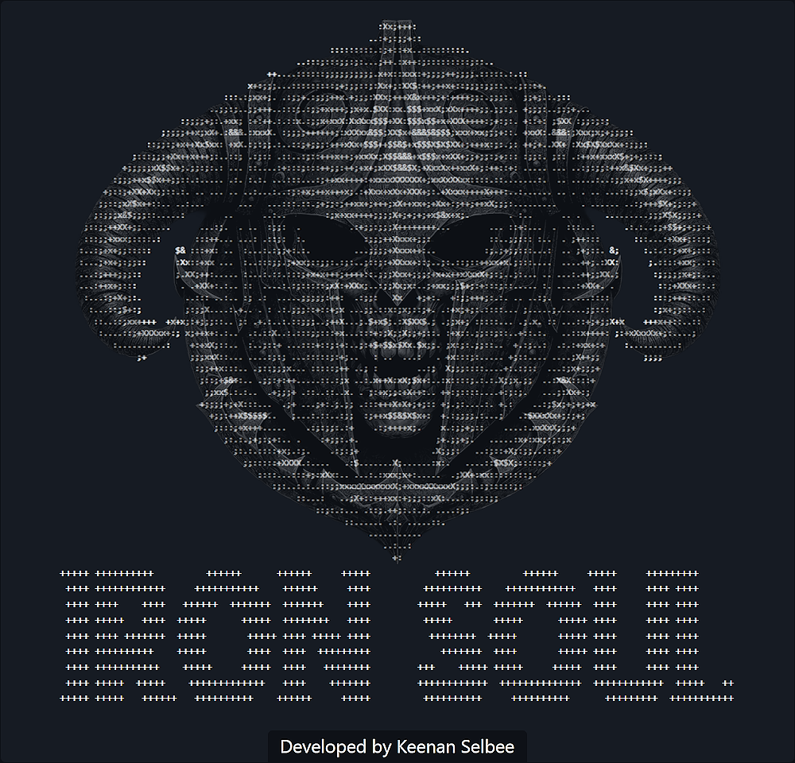

  

Iron Soul: Dead God's Dream
===========================

Iron Soul is a permadeath roguelite system for Skyrim with configurable death rules, Dragon Soul Revive,
and persistent progression, expanding into a multi-character saga built around Heartstones and escalating undead pressure.

Version
-------

0.7: The Missing Heart

Current TODO
------------

- Introduce Heartstones as permanent discoveries that can be found across multiple characters. These may drop from randomly strong enemies or be found spawned in the world.
- Use Heartstone progress to unlock account-level perks that persist beyond individual character deaths.
- Add permanent account-level perk unlocks tied to Heartstone progress.
- Integrate cinematic dragon soul absorption. Make DSR wind effect isolated.
- See if swfs can be replaced by prismaUI? Then see if text strings can be localized outside the scripts.

Roadmap
-------

V2: Echoes of Lorkhan
- Add a dream system. After the first Heartstone is absorbed, the player has a chance to receive dreams while sleeping.
- More Heartstones absorbed increase dream chance, expand the dream pool, and cause more metaphysical Heartstones to appear in Skyrim. "The Heart wants to be whole again..."
- Dreams focus mostly on historical echoes tied to Lorkhan, the Heart, Kagrenac, the Dwemer, the Tribunal, Red Mountain, and the player's growing connection to the Heartstones.
- Dreams include quick scenes and distorted echoes involving Kagrenac's use of the Tools, the disappearance of the Dwemer, Dagoth Ur's fall, and the Tribunal's later use of the Heart.
- Early dreams are fragmented and ambiguous, making it unclear whether the voice guiding the player is Lorkhan, the Heart itself, or something else speaking through it.
- Flesh out the history around Lorkhan, the Heart, and the player's connection to the Heartstones.
- Expand the Heart mystery into a stronger story layer that recontextualizes the V1 Heartstone hunt.

V3: The Dragon Cult Rises
- Rework Draugnarok raid pressure so the endgame source is Labyrinthian and the active pressure network flows from dragon priest barrows.
- Spawn lower raid categories from the closest active dragon priest barrow instead of generic locations where practical.
- Turn roaming mobs into reinforcement bands that travel from dragon priest barrows to Labyrinthian and guard there until cleaned up.
- Completing Labyrinthian should disable or heavily suppress minor capital raids, capital raids, and gate crashes.
- Killing a dragon priest should disable or reduce the raid pressure linked to that priest's barrow.
- Dragon priest anchors to explore: Morokei at Labyrinthian, Rahgot at Forelhost, Hevnoraak at Valthume, Vokun at High Gate Ruins, Volsung at Volskygge,
  Otar at Ragnvald, Nahkriin at Skuldafn, and Krosis at Shearpoint with possible Korvanjund support routing.
- Restore the kill-handler concept as a notification-area draugr kill counter that tracks kills by the player, followers, summons, or player-owned actors.
- Display draugr kill count updates through lightweight notifications.
- Build hidden draugr heat from draugr kills and dragon soul absorption, with dragon souls acting as a louder supernatural signal.
- Use higher heat to increase the chance of a draugr assassin or personal vengeance squad during a Draugnarok pulse.
- Add heat decay, cooldowns, post-attack reduction, and loop protection so assassin kills do not recursively create more assassin pressure.
- Explore optional The Restless Dead integration for richer undead visual variety while preserving Dragon Cultist identity.
- Alduin remains defeatable in V3.

V4: Return of the Dead God
- Add a full quest powered by the dream system, building on the historical Heart dreams introduced in V2.
- As more Heartstones are absorbed, the dreams become more direct and begin instructing the player to gather the Tools of Kagrenac through a required mod.
- Dreams reveal that only the Heart's power can make Alduin truly vulnerable.
- Once all Heartstones have been absorbed, the Heart manifests inside a dream realm the player can access at any time. At first, the Heart is incomplete and unsafe to strike.
- If the player uses the Tools on the Heart before the correct ritual is known, the game quits outright.
- A final dream falsely instructs the player to strike the Heart with Sunder once, then Keening once. Following this instruction triggers Dagoth Ur's reveal and awakens Dagoth Soul.
- Reveal that the apparent voice of Lorkhan is actually Dagoth Ur's dream-shadow manipulating the player.
- Through Dagoth Ur's dream-shadow, the player glimpses forbidden knowledge of what happened beneath Red Mountain. This stolen Heart-memory becomes the secret that can be offered to Hermaeus Mora.
- Alternatively, after Dragonborn is completed, Hermaeus Mora may send a vision warning that the force linked to the player is not Lorkhan, but a dark entity trying to control the Heart.
- Add an Apocrypha bargain scene where the player offers Mora the stolen Heart-memory: forbidden knowledge glimpsed through Dagoth's dreams about Kagrenac, the Tools, and the disappearance of the Dwemer.
- Mora reveals that resisting Dagoth requires striking the Heart in the hidden sequence: Sunder, Keening, Sunder, Keening. Performing this sequence awakens Shezarrine Soul.
- Any incorrect use of the Tools on the manifested Heart, other than the Dagoth sequence or the Mora-taught sequence, quits the game outright.
- Choose to accept Dagoth Ur's dream-shadow and awaken Dagoth Soul, or bargain with Mora for the forbidden knowledge needed to resist Dagoth and awaken Shezarrine Soul.
- Main Quest edit: Alduin is unkillable at the Throat of the World until the Heart of Lorkhan quest is completed. When he reaches 0 HP, he does not die; instead, he recovers, deals increased damage, and taunts the player.
